## SVANM-CSCV2025

### Mộch!ch!'s memories

Nah, cay mỗi bài này nên viết thôi. À thì lúc mình làm bài này cũng cuống vl méo hiểu sao ngta solve nhanh thế. Lúc biết là string grep ra flag thì caydodai.


Không bàn đến việc unintend nó nữa, wu này trình bày cách mình tiếp cận chall này.

Challenge cho ta 1 file mem với mô tả, dựa theo mô tả thì ta cần target vào tiến trình là nguyên nhân dẫn đến crash?

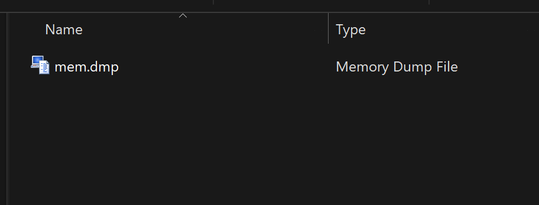

```
My friend created a vault manager to store process's secret, unfortunately we haven't contacted for years.
After playing with this program for a while, I noticed there was another user on my computer also used
this program, and somehow it crashed my pc when I tried checking other's secret? Please help me getting
all the secrets!

Note: A gentle reminding that description is really important to solve the chal <3

Pw: f69203c99d9f48fbf8060bef045023aa

Please verify challenge's checksum before usage, always be mindful of what you're doing.

MD5: f3af82ce151d0851209973087c529b9e
SHA1: 0f7a865e68424a9dff95e4d5574088a585865e38
```

#### MISC

Quăng vào windbg, với 1 vài lệnh đơn giản ta thấy được:

```windbg
9: kd> !analyze -v
Loading Kernel Symbols
...............................................................
................................................................
..............................................................
Loading User Symbols
..............................
Loading unloaded module list
.........
*******************************************************************************
*                                                                             *
*                        Bugcheck Analysis                                    *
*                                                                             *
*******************************************************************************

SYSTEM_SERVICE_EXCEPTION (3b)
An exception happened while executing a system service routine.
Arguments:
Arg1: 00000000c0000005, Exception code that caused the BugCheck
Arg2: fffff8035be810fc, Address of the instruction which caused the BugCheck
Arg3: ffffd0853d268010, Address of the context record for the exception that caused the BugCheck
Arg4: 0000000000000000, zero.

Debugging Details:
------------------

Unable to load image \??\C:\Users\a\Desktop\personalVaultKernel.sys, Win32 error 0n2
Unable to load image C:\Users\a\Desktop\aPersonalVault.exe, Win32 error 0n2
*** WARNING: Unable to verify checksum for aPersonalVault.exe
Unable to load image C:\Users\a\Desktop\aPersonalVault.exe, Win32 error 0n2
*** WARNING: Unable to verify checksum for aPersonalVault.exe
Unable to load image C:\Users\a\Desktop\aPersonalVault.exe, Win32 error 0n2
*** WARNING: Unable to verify checksum for aPersonalVault.exe
```

Như trên đây ta có thể thấy có vẻ các file trên là nguyên nhân dẫn đến crash như mô tả đề bài, mình sẽ tìm cách dump chúng ra.

- Driver lỗi: `personalVaultKernel.sys`
- Process gây ra: `aPersonalVault.exe`

```cmd
9: kd> lm
start             end                 module name
00007ff6`73ba0000 00007ff6`73bc3000   aPersonalVault C (no symbols)
....
fffff803`5be80000 fffff803`5be89000   personalVaultKernel   (no symbols)
...

9: kd> lmDvmaPersonalVault
Browse full module list
start             end                 module name
00007ff6`73ba0000 00007ff6`73bc3000   aPersonalVault C (no symbols)
    Loaded symbol image file: aPersonalVault.exe
    Image path: C:\Users\a\Desktop\aPersonalVault.exe
    Image name: aPersonalVault.exe
    Browse all global symbols  functions  data  Symbol Reload
    Timestamp:        Fri Oct 10 06:37:17 2025 (68E8472D)
    CheckSum:         00000000
    ImageSize:        00023000
    Translations:     0000.04b0 0000.04e4 0409.04b0 0409.04e4
    Information from resource tables:
9: kd> lmDvmpersonalVaultKernel
Browse full module list
start             end                 module name
fffff803`5be80000 fffff803`5be89000   personalVaultKernel   (no symbols)
    Loaded symbol image file: personalVaultKernel.sys
    Image path: \??\C:\Users\a\Desktop\personalVaultKernel.sys
    Image name: personalVaultKernel.sys
    Browse all global symbols  functions  data  Symbol Reload
    Timestamp:        Thu Oct  9 22:16:44 2025 (68E7D1DC)
    CheckSum:         00011A41
    ImageSize:        00009000
    Translations:     0000.04b0 0000.04e4 0409.04b0 0409.04e4
    Information from resource tables:
```

Trên đây là 1 vài thông tin cần thiết để mò đến các giá trị trong mem. Ta sẽ sử dụng đến chúng sau.

Giờ thì để dump 2 tiến trình này ra. Mình sử dụng [MemProcFS](https://github.com/ufrisk/MemProcFS).

```powershell
MemProcFS.exe -device "file path" -forensic 1
```

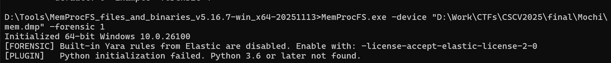

Giờ thì vào ổ đĩa ảo nó tạo ra để lấy file thôi.

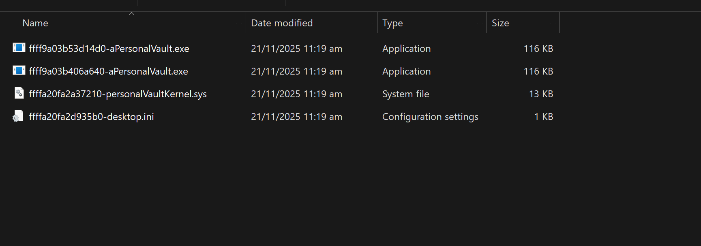

#### Analize

##### aPersonalVault.exe

Chương trình này làm nhiệm vụ đúng như mô tả đề bài là thực hiện tạo `User/pass`.

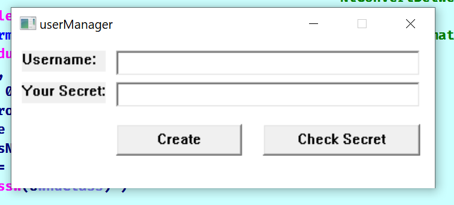

Cụ thể thì, với chức năng `Create`, chương trình sẽ tạo 48 byte là key và iv để mã hóa secret ta nhập vào bằng `AES-CBC`.

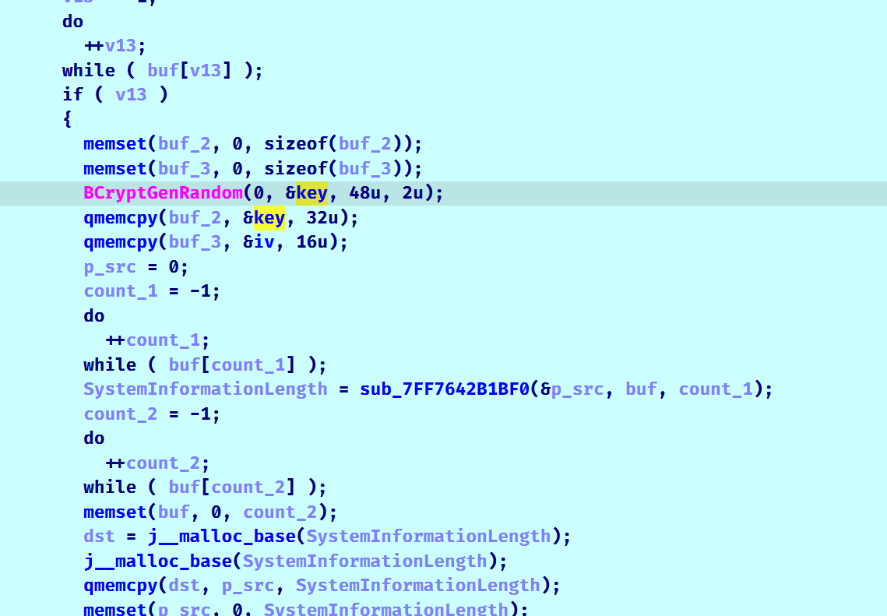

Sau đó đưa username thành dạng checksum rồi gửi dữ liệu xuống kernel bằng `NtQuerySystemInformation` với partern `34 33 32 31` và option `2`.

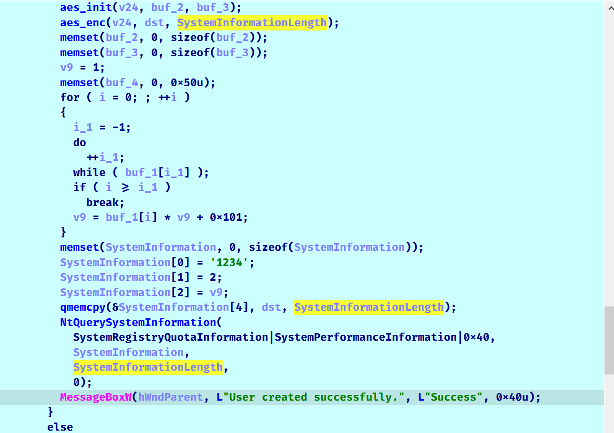

Còn khi bấm `Check` chương trình sẽ query secret từ kernel với option `1`.

```C
buf_5[0] = '1234';
buf_5[1] = 1;
buf_5[2] = v6;
buf_5[3] = 0x100;

NtQuerySystemInformation(
    SystemRegistryQuotaInformation|SystemPerformanceInformation|0x40,
    buf_5,
    0x10u,
    0);
```

Vấn đề là chương trình chỉ gửi cipher đi và key + iv thì gen lại sau mỗi lần tạo user mới. Nên nếu tạo nhiều user thì hết cứu. Rất may ở đây là tác giả chỉ tạo 1 tài khoản mỗi user.

##### personalVaultKernel.sys

Tiếp đến ta xem nó xử lý ở kernel ra sao.

Trước tiên ta biết khi nào thì chương trình bị crash. Khi nhận dữ liệu có partern là `30 30 30 30` với option là `1` chương trình chạy vào block có lệnh `mov [rax], al`.

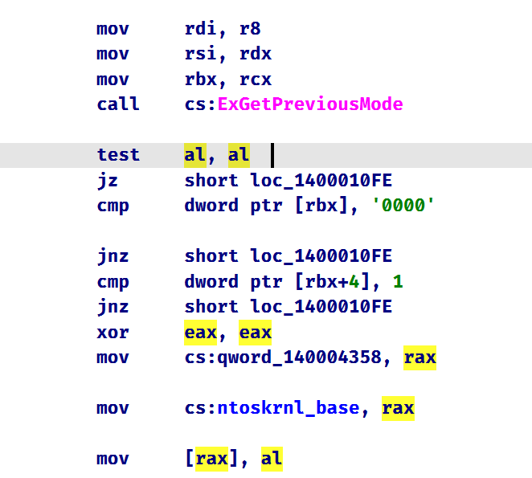

```asm
personalVaultKernel+0x10fc:
fffff803`5be810fc 8800    mov byte ptr [rax],al
                           ds:002b:00000000`00000000=??
                                    ↑
                                    NULL POINTER!
```

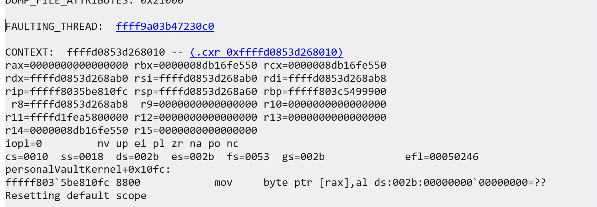

Bên cạnh đó còn 1 hàm xử lý nếu partern là `34 33 32 31`.

Nếu option là `1`, chương trình thực hiện chức năng READ, tìm kiếm cipher lưu trong dslk `List`- là 1 danh sách liên kết 2 chiều. và tìm kiếm bằng cách so sánh checksum của username.

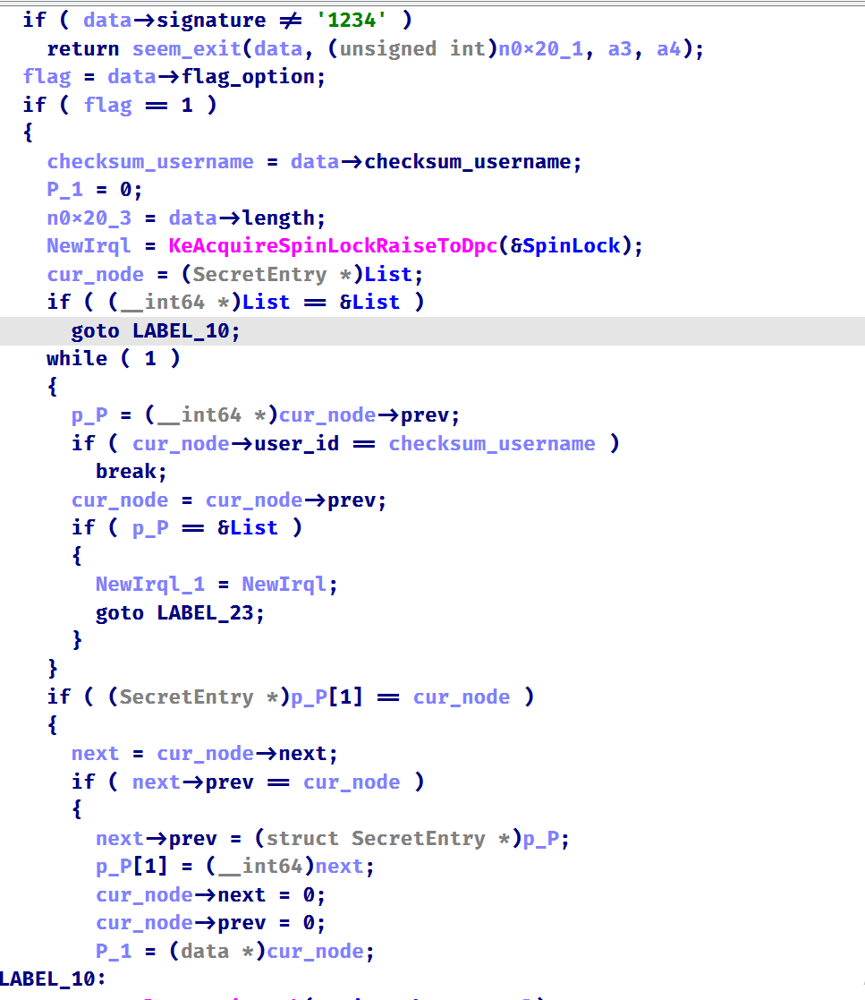

Option 2 thì dễ đoán là ngược lại -> chức năng write vào 1 node trong dslk.

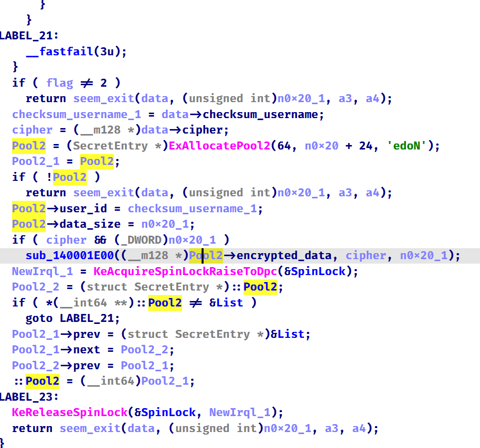

#### Mech

Tóm lại: aPersonalVault.exe và personalVaultKernel.sys giao tiếp với nhau.

aPersonalVault.exe thực hiện tạo user, gửi thông tin save/query check.
personalVaultKernel.sys thực hiện lưu trữ, handle các tín hiệu được gửi đến với con exe

#### Gather data

Ờ thì cơ bản là phân tích xong rồi, đi nhặt data thôi.

Để lấy `Key` và `IV`, như đã nói ở trên, chúng được lưu vào biến tại `.data` nên ta có thể dùng windbg mò đến offset và nhặt ra.

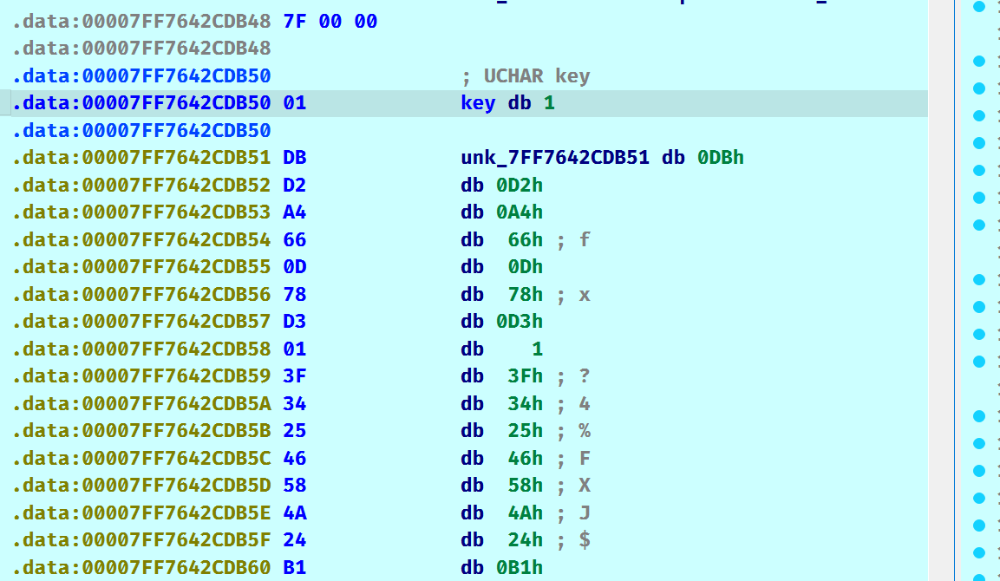

Trước tiên là lấy RVA đã.

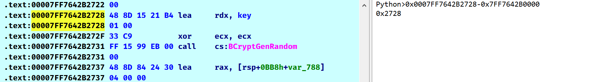

Tiếp theo là đến 2 tiến trình aPersonalVault.exe

```
9: kd> !process 0 0
**** NT ACTIVE PROCESS DUMP ****

...

PROCESS
    SessionId: none  Cid: 17b8    Peb: 8db14c5000  ParentCid: 166c
    DirBase: 21debd000  ObjectTable: ffff8a0b556d3c80  HandleCount: 163.
    Image: aPersonalVault.exe

...

PROCESS ffff9a03b33bb080
    SessionId: none  Cid: 1218    Peb: 8529b20000  ParentCid: 166c
    DirBase: be51d000  ObjectTable: ffff8a0b55de0c00  HandleCount: 164.
    Image: aPersonalVault.exe

...
```

Switch cpu context rồi lấy base của `aPersonalVault.exe`.

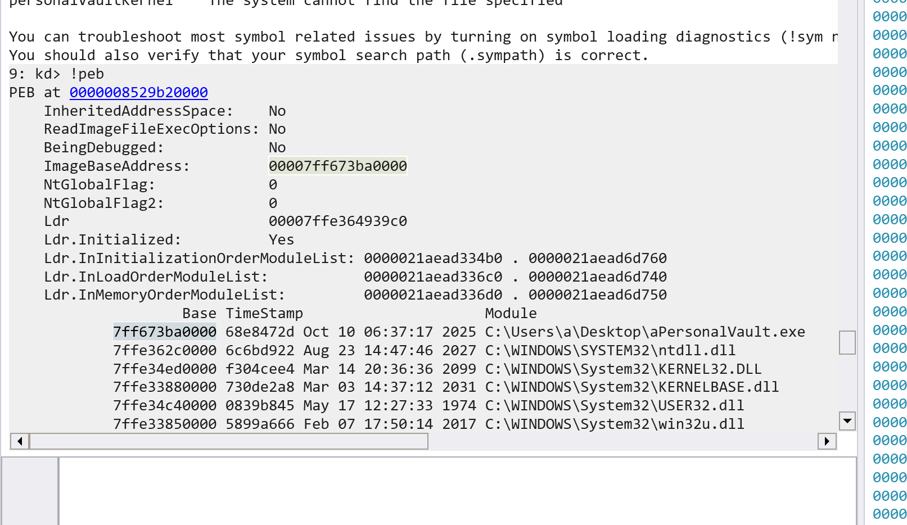

Nhảy đến và lấy địa chỉ của key.

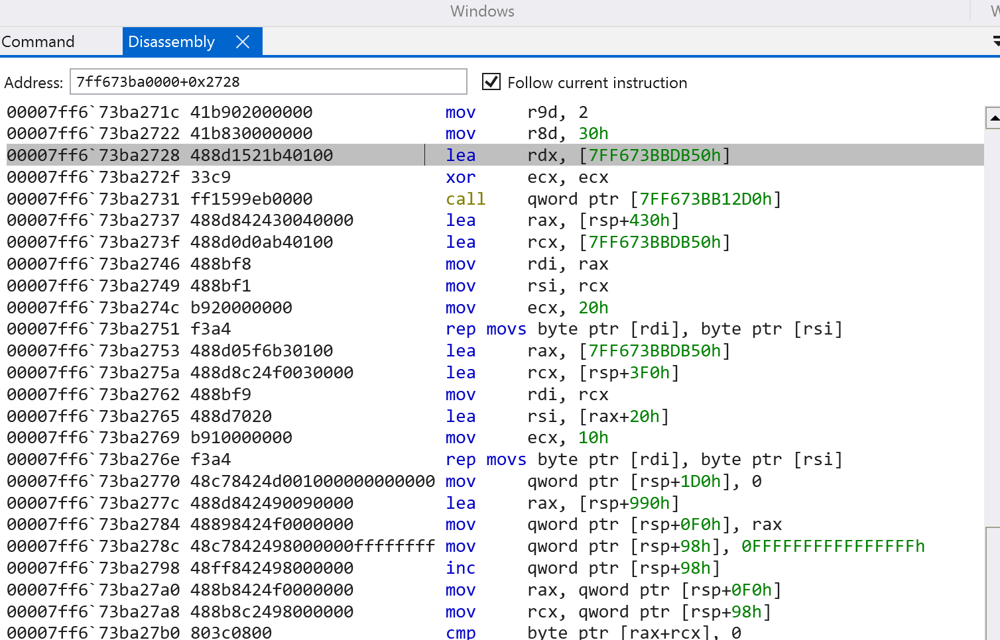

Rồi giờ nhặt key iv từ địa chỉ đó thôi.

```
9: kd> .process /r /p ffff9a03b53130c0
Implicit process is now ffff9a03`b53130c0
Loading User Symbols
..............................

************* Symbol Loading Error Summary **************
Module name            Error
personalVaultKernel    The system cannot find the file specified

You can troubleshoot most symbol related issues by turning on symbol loading diagnostics (!sym noisy) and repeating the command that caused symbols to be loaded.
You should also verify that your symbol search path (.sympath) is correct.
9: kd> db 7FF673BBDB50h L100
00007ff6`73bbdb50  d4 b6 c8 13 80 1d 55 8b-85 99 5e e5 90 54 00 9f  ......U...^..T..
00007ff6`73bbdb60  4a 8e 8a f1 79 4f ec 77-70 ab b9 eb f8 68 5c 0a  J...yO.wp....h\.
00007ff6`73bbdb70  21 ec 72 b5 5e 9e 8d cc-a3 cb d4 58 da d5 28 93  !.r.^......X..(.
00007ff6`73bbdb80  01 00 00 00 00 00 00 00-c8 03 03 00 00 00 00 00  ................
00007ff6`73bbdb90  d2 03 05 00 00 00 00 00-cc 03 03 00 00 00 00 00  ................
00007ff6`73bbdba0  f2 00 03 00 00 00 00 00-00 00 00 00 00 00 00 00  ................
00007ff6`73bbdbb0  00 00 00 00 00 00 00 00-00 00 00 00 00 00 00 00  ................
00007ff6`73bbdbc0  00 00 00 00 00 00 00 00-00 00 00 00 00 00 00 00  ................
00007ff6`73bbdbd0  00 00 00 00 00 00 00 00-00 00 00 00 00 00 00 00  ................
00007ff6`73bbdbe0  00 00 00 00 00 00 00 00-00 00 00 00 00 00 00 00  ................
00007ff6`73bbdbf0  00 00 00 00 00 00 00 00-00 00 00 00 00 00 00 00  ................
00007ff6`73bbdc00  00 00 00 00 00 00 00 00-00 00 00 00 00 00 00 00  ................
00007ff6`73bbdc10  00 00 00 00 00 00 00 00-00 00 00 00 00 00 00 00  ................
00007ff6`73bbdc20  00 00 00 00 00 00 00 00-00 00 00 00 00 00 00 00  ................
00007ff6`73bbdc30  00 00 00 00 00 00 00 00-00 00 00 00 00 00 00 00  ................
00007ff6`73bbdc40  00 00 00 00 00 00 00 00-00 00 00 00 00 00 00 00  ................


9: kd> .process /r /p ffff9a03b33bb080
Implicit process is now ffff9a03`b33bb080
Loading User Symbols
..............................

************* Symbol Loading Error Summary **************
Module name            Error
personalVaultKernel    The system cannot find the file specified

You can troubleshoot most symbol related issues by turning on symbol loading diagnostics (!sym noisy) and repeating the command that caused symbols to be loaded.
You should also verify that your symbol search path (.sympath) is correct.
9: kd> db 7FF673BBDB50h L100
00007ff6`73bbdb50  c7 07 b1 8b f4 fb 52 11-d1 cb da 2c ac 92 0b c7  ......R....,....
00007ff6`73bbdb60  b6 30 61 a1 09 c3 ca 74-94 0c a3 ad bf db 10 1f  .0a....t........
00007ff6`73bbdb70  fc 80 59 c0 53 4b d9 f1-86 7c e0 9a 16 c7 fc 65  ..Y.SK...|.....e
00007ff6`73bbdb80  01 00 00 00 00 00 00 00-5a 00 03 00 00 00 00 00  ........Z.......
00007ff6`73bbdb90  5c 03 02 00 00 00 00 00-5c 00 03 00 00 00 00 00  \.......\.......
00007ff6`73bbdba0  28 03 05 00 00 00 00 00-00 00 00 00 00 00 00 00  (...............
00007ff6`73bbdbb0  00 00 00 00 00 00 00 00-00 00 00 00 00 00 00 00  ................
00007ff6`73bbdbc0  00 00 00 00 00 00 00 00-00 00 00 00 00 00 00 00  ................
00007ff6`73bbdbd0  00 00 00 00 00 00 00 00-00 00 00 00 00 00 00 00  ................
00007ff6`73bbdbe0  00 00 00 00 00 00 00 00-00 00 00 00 00 00 00 00  ................
00007ff6`73bbdbf0  00 00 00 00 00 00 00 00-00 00 00 00 00 00 00 00  ................
00007ff6`73bbdc00  00 00 00 00 00 00 00 00-00 00 00 00 00 00 00 00  ................
00007ff6`73bbdc10  00 00 00 00 00 00 00 00-00 00 00 00 00 00 00 00  ................
00007ff6`73bbdc20  00 00 00 00 00 00 00 00-00 00 00 00 00 00 00 00  ................
00007ff6`73bbdc30  00 00 00 00 00 00 00 00-00 00 00 00 00 00 00 00  ................
00007ff6`73bbdc40  00 00 00 00 00 00 00 00-00 00 00 00 00 00 00 00  ................
```

Làm tương tự với con `.sys` để lấy cipher vì con trỏ `List` của nó cũng được lưu trong `.data`

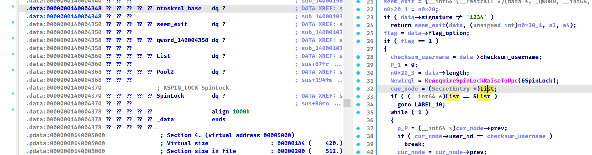

Nhảy đến `0FFFFF8035BE84360h` ta thấy con trỏ trỏ đến dữ liệu tiếp theo `20 C1 2A A3 0F A2 FF FF`.

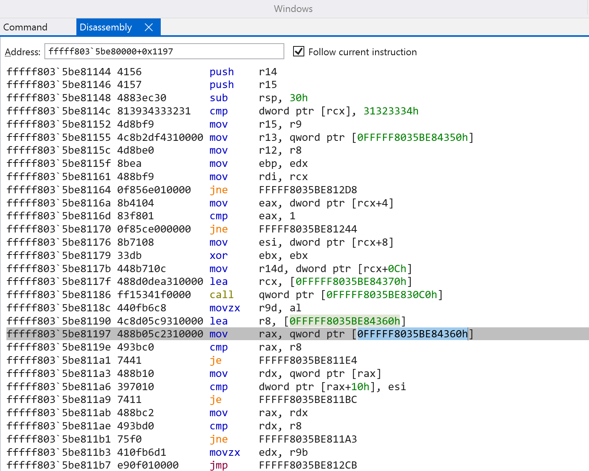

CT1: `0C 5C 7D BB D7 C5 FF D2 49 7D 97 2C 41 7B B8 8F CD F1 2C 83 50 C0 1A B7 FF A3 87 16 57 DE A5 D3 2F 60 BB 91 60 99 4D 3F 79 F1 8C 14 E9 D9 58 54 30 B3 84 58 5E 0F 8E D5 FA 47 88 F0 D4 B5 16 23`

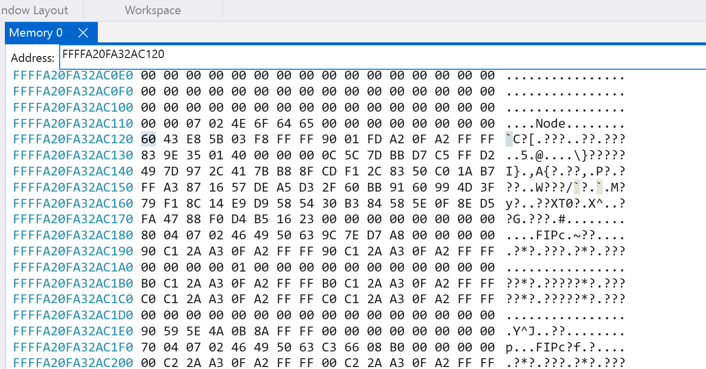

Tương tự trỏ đến CT2: `BD 3F 49 E7 86 50 F7 B9 7A 82 3B 1E C1 F7 72 7E 4C 6A A4 87 DE 54 76 75 1B E6 79 E2 50 9B FE DD 71 F0 CE ED 26 B4 99 E7 C8 9B 82 3D C3 6E 12 69 10 46 8D 56 AC 5E 84 AD EA 1A 6C 6B D6 44 7A F6 F0 EE 68 D9 96 BB D9 5F 2E 1A 48 38 EF BE 9E 4B`
tại `FFFFA20FA2FD0190`.

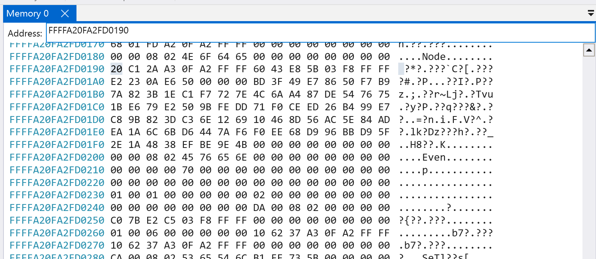

#### Decrypt

Giờ thì decrypt ra 1 bộ, bộ còn lại thì không decrypt ra. Tới đây bắt đầu ngố@@

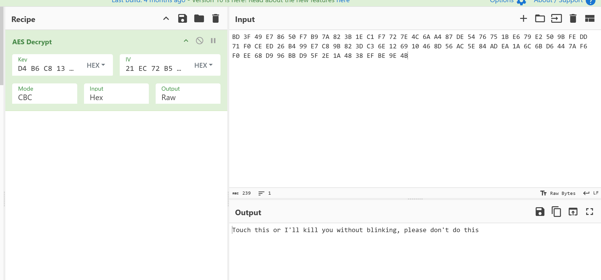

Nah giờ ngẫm lại thì decrypt ra rõ ràng là hint rằng mình đang đi sai rồi mà cuống wa.

#### Antidebug

Bởi vì luồng chương trình không đơn giản vậy, mình đã bỏ qua 1 đoạn antidebug.

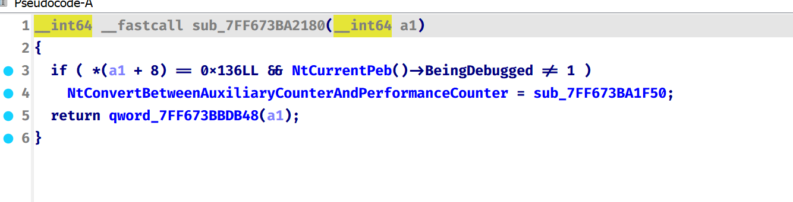

Nếu không dính, nó sẽ thực hiện hook vào `NtConvertBetweenAuxiliaryCounterAndPerformanceCounter` và xor ct của mình với key `CSCV2025` rồi gửi lại kernel.

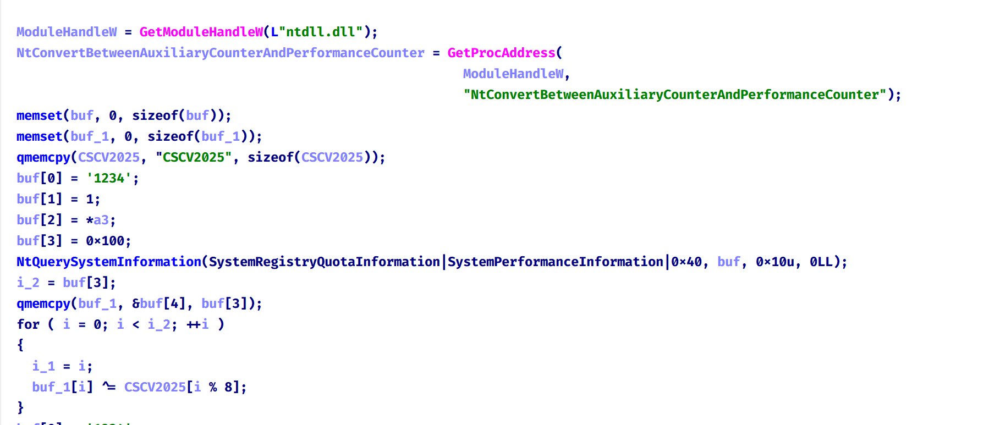

Đoạn bị hook nằm ở đây, với thông số gửi đi là `30 30 30 30` với option `1`, ta sẽ bị crash như ban đầu phân tích.

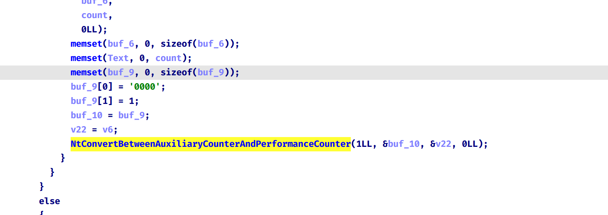

Làm bài có antidebug trong init không biết bao nhiêu lần rồi mà vẫn dính thì do ngu thôi biết sao giờ.

Giờ thì rõ rồi, ct dump ra từ mem của con .sys cần xor thêm với key `CSCV2025`.

Và cần làm theo luồng chương trình để lấy flag(đoạn này kịch bản hơi điêu vì key/iv gen ra random mà lại decrypt ra flag bằng cách check?)-thì ta sẽ xor rồi encrypt bằng key/iv đầu tiên(vì key/iv đầu tiên có thể decrypt ra `Plaintext: Touch this or I'll kill you without blinking, please don't do this` mà không lỗi)
rồi tiếp đến là thao tác check của user hiện tại làm crash, ta sẽ decrypt bằng cặp key iv còn lại để hoàn thành thao tác decrypt sau check).

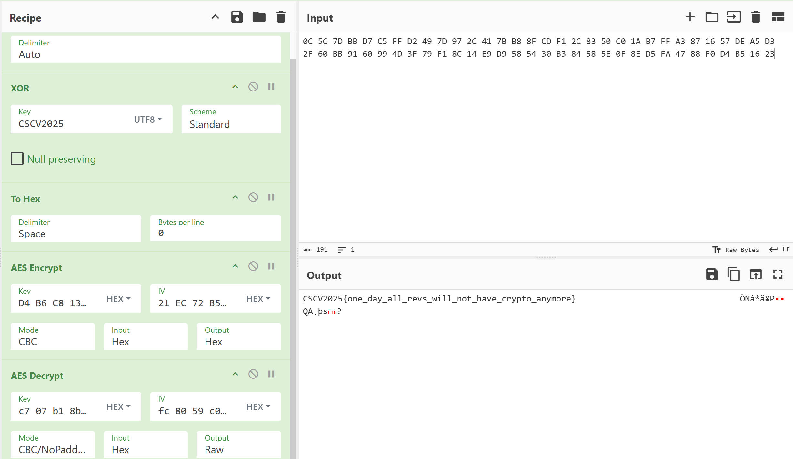

```
CSCV2025{one_day_all_revs_will_not_have_crypto_anymore}
```

## Tổng kết

:D Dm plot liên tục(do gà không nhận ra).
